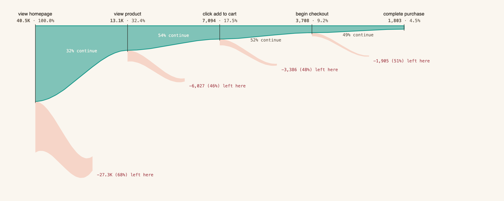
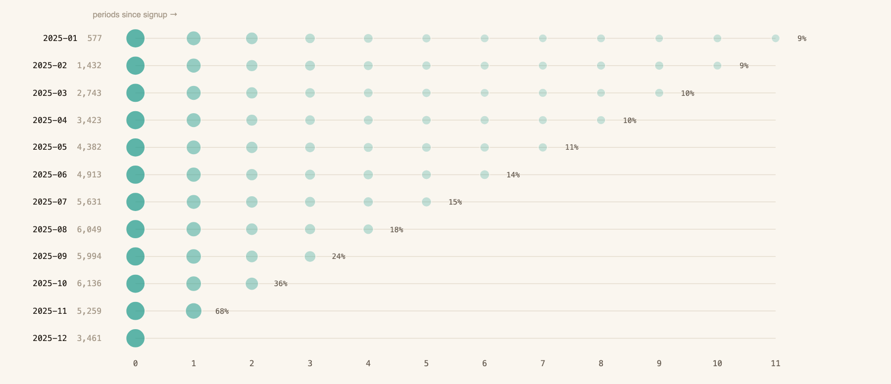
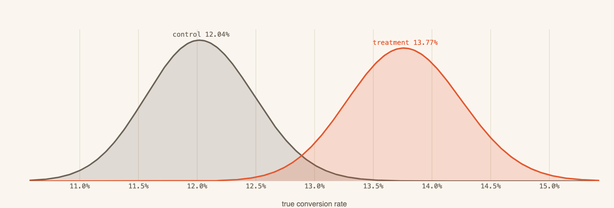
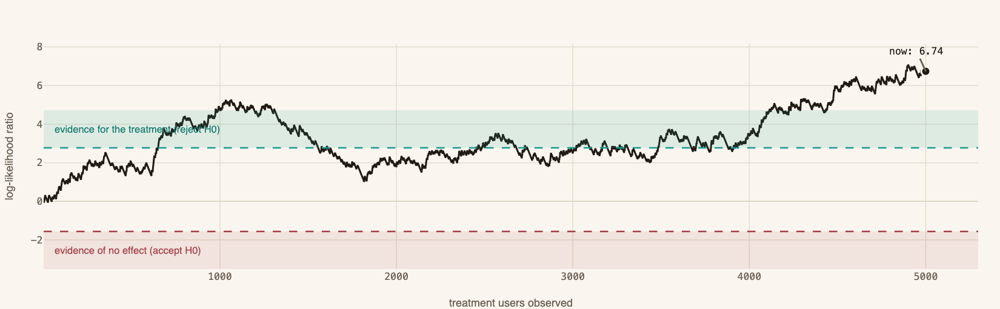
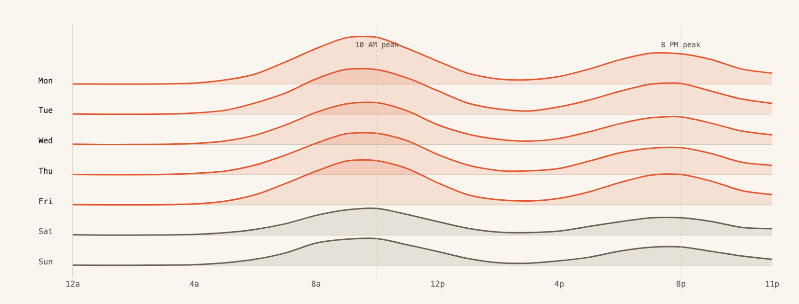
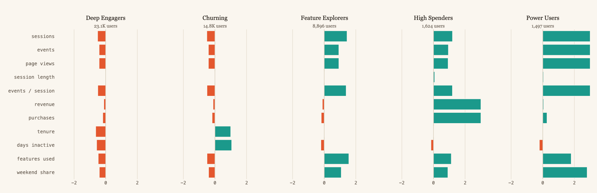
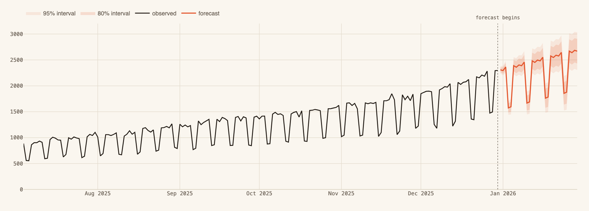

# Product Analytics Engine

A full product analytics platform I built end to end: a synthetic event generator that produces a year of realistic product telemetry for 50K users, a DuckDB analytical store, four analytics engines (funnels, cohort retention, segmentation, sessions), a statistics layer (frequentist and Bayesian A/B testing, sequential testing, power analysis, Holt-Winters forecasting, anomaly detection), Dagster orchestration, a FastAPI REST API, and a six-view Streamlit dashboard with a visualization system I designed from scratch.

This is the kind of system a growth team at a SaaS or e-commerce company builds internally. I built it to show that I can, and that I can make every layer of it hold up: the statistics are textbook-correct, the SQL is set-based and fast, the data actually behaves like a real product, and the dashboard doesn't look like anyone else's.

| | |
|---|---|
| Users | 50,000 |
| Sessions | 428,967 |
| Events | 2,154,361 across one year |
| Revenue | $183,198 from 1,921 purchases by 1,803 buyers |
| Database | one DuckDB file, ~640 MB |
| Tests | 48, all passing in CI |


## The dashboard

Most analytics dashboards are the same dark-mode grid of default library charts. I deliberately went the other way: warm paper background, editorial typography (Fraunces for headlines, IBM Plex Mono for figures), and a six-hue palette I validated programmatically for colorblind separation and contrast before using it. More importantly, each view's chart form is built out of the shape of the thing it measures instead of poured into a stock chart type.

### The conversion river

A funnel is a river that narrows. So instead of stacked trapezoids, the funnel page draws the surviving flow as a teal ribbon thinning through five gates, and at every gate the users who left peel off as a fading distributary labeled with exactly how many left and what share that was. The overall conversion rate is literally visible as how much of the river reaches the end.



### Cohort comet trails

The standard retention view is a red-to-green heatmap. Here each signup cohort is a comet: it enters at period 0 at full size, and both the dot area and the ink fade exactly as fast as its users stop coming back. A durable cohort is simply one you can still see far to the right. Reading down a column compares cohorts at the same age; reading along a row is one cohort's whole life.



### The anatomy of a decision

Every experiment gets read three ways, because each answers a different question. The posterior landscape shows what we now believe each variant's true rate is (the overlap is the remaining doubt). The sequential decision corridor shows Wald's SPRT log-likelihood ratio walking between decision rails as users accumulate, which answers when we could have stopped. The power curve shows what the experiment could ever have detected in the first place.




### The week's pulse

Event volume by hour of day, one ridge per weekday. The product's rhythm (10 AM and 8 PM peaks, quieter weekends) is the actual finding, so the chart is a ridgeline built to show exactly that shape, with every ridge sharing one scale so flatter weekend ridges are genuinely quieter days.



### The rest of the system

The segmentation page places every user as a dot (recency against frequency, sized by spend) with segment labels set directly at each segment's center of mass, and replaces the usual radar chart with cluster fingerprints: diverging bars showing how far each K-means cluster sits from the population mean on every behavioral feature, in standard deviations. The forecasting page draws the future as a cone that widens with the square root of the horizon, with anomalous days flagged as haloed flares against 3-sigma control rails.




Every color in the system passes a six-check palette validator (lightness band, chroma floor, colorblind-vision separation with worst adjacent pair delta E 11.8 under deuteranopia, normal-vision floor, and 3:1 contrast against the paper surface). Nothing on any page is demo data; if the database is missing, the dashboard says so instead of showing fabricated numbers.

## Architecture

```
 Synthetic Event Generator ──► DuckDB analytical store
        50K users                events / users / sessions /
        1 year of telemetry      experiments / daily_metrics
             │                          │
             │                          ▼
             │                 Analytics Engines            Statistics Layer
             │                 ─ funnels (ordered, SQL)     ─ z-test / Welch t / chi-sq
             │                 ─ cohort retention           ─ Bayesian (Beta-Bernoulli MC)
             │                 ─ RFM + K-means clusters     ─ SPRT sequential testing
             │                 ─ session metrics            ─ power analysis
             │                          │                   ─ Holt-Winters forecasting
             ▼                          │                   ─ Isolation Forest anomalies
      Dagster pipeline                  │                          │
      ─ daily partitioned assets        ▼                          ▼
      ─ weekly retention/RFM jobs   FastAPI REST API  +  Streamlit dashboard
      ─ idempotent upserts          /api/v1/*            six views, live SQL
```

DuckDB does all the heavy lifting. Funnels, retention matrices, RFM scoring, and session aggregates are single set-based SQL queries over 2M+ rows, not pandas loops, so every dashboard interaction recomputes live in tens of milliseconds. The Dagster layer exists for the production shape of the problem (daily partitioned assets, weekly full recomputations, idempotent upserts into `daily_metrics`), and a one-shot backfill covers the local-development case without running hundreds of partitions.

## Making the data behave like a product

The generator is where most of the design effort lives, because every analysis downstream is only as interesting as the patterns in the data. What it models, and why:

| Pattern | Mechanism |
|---|---|
| Power-law activity | Negative binomial session counts (overdispersed Poisson, r = 2); the top 20% of users get 4x the sessions |
| Churn | 25% of users are long-lived; the rest get exponential lifetimes (mean 50 days), so cohort retention decays like 0.25 + 0.75·exp(-t/50) onto a loyal-core floor |
| Growth | Signup dates drawn from Beta(2, 1.4) across the year, putting ~60% of signups in the second half |
| Weekly rhythm | Weekday sessions 2x weekend; hours bimodal around 10 AM and 8 PM |
| Browsing behavior | In-session event sequences follow a 7-state Markov transition matrix; inter-event gaps are exponential (mean 45s) |
| Funnel behavior | Each session draws its deepest funnel stage from a calibrated distribution, and those steps are woven into the sequence in order |
| Revenue | Purchase amounts are lognormal(mu=4, sigma=1): median around $55 with a right tail |
| Experiments | Three A/B tests with known ground-truth effects baked in, including one designed to be mildly harmful, so the statistics layer can be graded against known answers |

The funnel calibration deserves a note, because it came out of a real failure. My first version let the Markov chain produce funnel events organically, with ordering enforced. When I actually computed the funnel on generated data, zero users had ever purchased. The compound probability of a chain emitting five specific events in order inside a ~5-event session is around 10^-5, so the entire revenue side of the dataset silently never existed. The fix inverts control: sessions draw how deep they go (with per-session probabilities chosen so that user-level conversion over a year of ~20 sessions lands at a realistic narrowing shape), and the funnel events are placed into the sequence deterministically. The chain fills in everything around them.

## The numbers

Everything below is computed from the actual generated dataset (seed 42), not aspirational:

**The funnel** (session-scoped, steps in order, computed live from 2.15M events in ~80 ms):

| Step | Users | Of entrants | Continue rate |
|---|---|---|---|
| view_homepage | 40,463 | 100.0% | |
| view_product | 13,121 | 32.4% | 32% |
| click_add_to_cart | 7,094 | 17.5% | 54% |
| begin_checkout | 3,708 | 9.2% | 52% |
| complete_purchase | 1,803 | 4.5% | 49% |

**Retention**: the median cohort keeps 52% of users in month 1 and 20% by month 3, decaying onto a loyal-core floor around 9%, which is exactly the shape the churn model was built to produce. The January cohort reads 100, 51, 31, 18, 14, 11, 9... across its year.

**The experiments** (ground truth was baked into the generator, so the statistics layer can be graded):

| Experiment | Designed effect | Measured | p-value | P(treatment better) | Call |
|---|---|---|---|---|---|
| checkout_flow_redesign | +16.7% relative conversion | +14.5% (12.0% to 13.8%) | 0.0094 | 99.5% | Ship it |
| pricing_page_copy | +15.6% revenue per user | +16.3% ($45.94 to $53.42) | <0.0001 | >99.9% | Ship it |
| onboarding_tutorial | slightly negative (35% to 33%) | -6.1% | 0.0429 | 2.1% | Keep control |

All three recover their designed truth, including the third one: it was built as a mildly harmful change, and both the frequentist and Bayesian reads catch it and recommend the control. The sequential test on the checkout experiment crosses Wald's reject boundary (LLR 6.74 against a 2.77 rail), meaning it could have been stopped early with error rates intact.

## Statistical methods

The A/B layer runs every experiment through both schools:

- **Frequentist**: two-proportion z-test with pooled standard error for binary metrics (chi-squared computed as a cross-check; for a 2x2 table chi2 = z²), Welch's t-test with Welch-Satterthwaite degrees of freedom for continuous metrics, Cohen's h/d effect sizes, and post-hoc power via the non-central distribution.
- **Bayesian**: conjugate Beta-Bernoulli posteriors sampled by Monte Carlo (100K draws) to get P(treatment > control), the expected relative lift with a 95% credible interval, and the expected loss of each decision, which is the number I would actually want in a launch review: how much conversion do I give up if I ship the wrong variant?
- **Sequential**: Wald's SPRT with boundaries A = ln(beta/(1-alpha)) and B = ln((1-beta)/alpha), so an experiment can be monitored continuously with controlled error rates instead of waiting for a fixed horizon.
- **Planning**: two-proportion and two-sample sample-size formulas, plus power-versus-n curves rendered per experiment.

Forecasting uses Holt-Winters exponential smoothing (additive trend and weekly seasonality) with model fallbacks for short series, and prediction intervals that widen with sqrt(horizon). Anomaly detection runs Isolation Forest over engineered features (rolling statistics, day-of-week, deviation z-scores) alongside a 3-sigma control chart, and flags a day if either method fires.

## Getting started

```bash
git clone https://github.com/Kenny0bi/product-analytics-engine.git
cd product-analytics-engine
python -m venv .venv && source .venv/bin/activate
pip install -r requirements.txt

# Generate the dataset (~2M events, takes a few minutes) and load DuckDB
python -m src.main generate --num-users 50000 --seed 42

# Materialize daily metrics and run every analytics computation once
python -m src.main analyze

# Serve
python -m src.main serve        # FastAPI on :8000, docs at /docs
python -m src.main dashboard    # Streamlit on :8501
```

Or with Docker (builds the dataset into the image):

```bash
docker compose up --build
# API on :8000, dashboard on :8501, Dagster UI on :3000
```

To see the orchestration DAG:

```bash
dagster dev -m src.pipeline.definitions
```

## API

| Endpoint | What it returns |
|---|---|
| `GET /api/v1/metrics/summary` | DAU, WAU, MAU, revenue, conversion, session duration snapshot |
| `GET /api/v1/metrics/daily` | Daily metric time series with dimensional filters |
| `GET /api/v1/funnels?steps=a,b,c` | Ordered funnel with per-step conversion and median inter-step times |
| `GET /api/v1/funnels/compare` | The same funnel split across segment values |
| `GET /api/v1/retention` | Cohort retention matrix (weekly or monthly) |
| `GET /api/v1/retention/curve` | Average retention curve across cohorts |
| `GET /api/v1/experiments/{id}` | Full frequentist + Bayesian analysis |
| `GET /api/v1/experiments/{id}/sequential` | SPRT state and decision |
| `POST /api/v1/experiments/power` | Sample-size calculation for planning |
| `GET /api/v1/segments/rfm` | RFM segment profiles |
| `GET /api/v1/segments/clusters` | Behavioral cluster profiles |
| `GET /api/v1/forecast/{metric}` | Point forecast with 80/95% intervals |
| `GET /api/v1/anomalies/{metric}` | Flagged anomalous days with severity |

## Testing

48 tests run in CI (GitHub Actions: ruff, mypy, then pytest against a freshly generated dataset). The unit tests pin the statistics to hand-calculated values (a known z-test example, SPRT boundary formulas, sample-size formulas), verify generator invariants (distributions, temporal ordering, referential integrity), and the integration tests exercise every API endpoint against a real DuckDB instance.

One testing lesson I'll keep: a test that passes vacuously is worse than no test. An early version of the session-ordering test did `dropna()` before asserting start <= end, which meant it kept passing while a write-back bug left every session's `ended_at` null. The generated sessions loaded cleanly, the dashboards would have shown 0% conversion everywhere, and the suite was green. The fixed test asserts the aggregates are populated before checking their ordering, and finding that class of bug is exactly why I now make tests assert presence, not just consistency.

## Things that bit me

Honest notes from the build, because these are the parts that taught me something:

- **DuckDB enforces NOT NULL on every primary key column.** The `daily_metrics` table was designed with nullable dimension columns inside a composite key ("null means overall"). Every insert would have failed on first pipeline run. The fix is an `'overall'` sentinel with a default, and it's a good reminder that "it's in the DDL" is not the same as "it executes."
- **Dagster rejects `from __future__ import annotations` in asset modules.** Postponed evaluation turns the `context` parameter's annotation into a string, and Dagster's runtime inspection refuses it with a genuinely confusing error message.
- **Verify the generated data, not just the generating code.** Both of the serious generator bugs (zero purchases, flat retention) were invisible in code review and obvious the moment I rendered a chart of the output. The charts were the test.

## Project structure

```
src/
  config/        Pydantic settings (PAE_* env overrides)
  data/          Event generator, DuckDB ingestion, CLI
  analytics/     Funnels, retention, segmentation, sessions
  statistics/    A/B testing, SPRT, power, forecasting, anomalies
  pipeline/      Dagster assets, schedules, backfill
  serving/       FastAPI app and routes
  dashboard/     Streamlit app, design system (theme.py), six views
sql/             Schema DDL, materialized view definitions
tests/           Unit + integration suites (shared fixtures in conftest)
docs/charts/     Rendered chart images used in this README
```

## References

- Kohavi, Tang, Xu. *Trustworthy Online Controlled Experiments* (2020)
- Wald. *Sequential Analysis* (1947)
- Gelman et al. *Bayesian Data Analysis*, 3rd ed.
- Hyndman, Athanasopoulos. *Forecasting: Principles and Practice*
- Liu et al. "Isolation Forest" (ICDM 2008)
